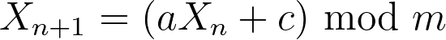
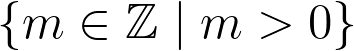
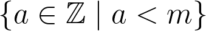
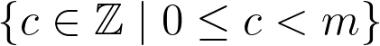
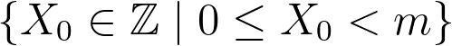

## Pseudo Random Number Generator

A pseudo random number generator based on the [Linear Congruential Generator](https://en.wikipedia.org/wiki/Linear_congruential_generator#Sample_code) algorithm.

The LCG is defined by the recurrence relation:

where:

 — The "Modulus" 
 — The "Multiplier" 
 — The "Increment" 
 — The "Seed" or "Starting Value" 
